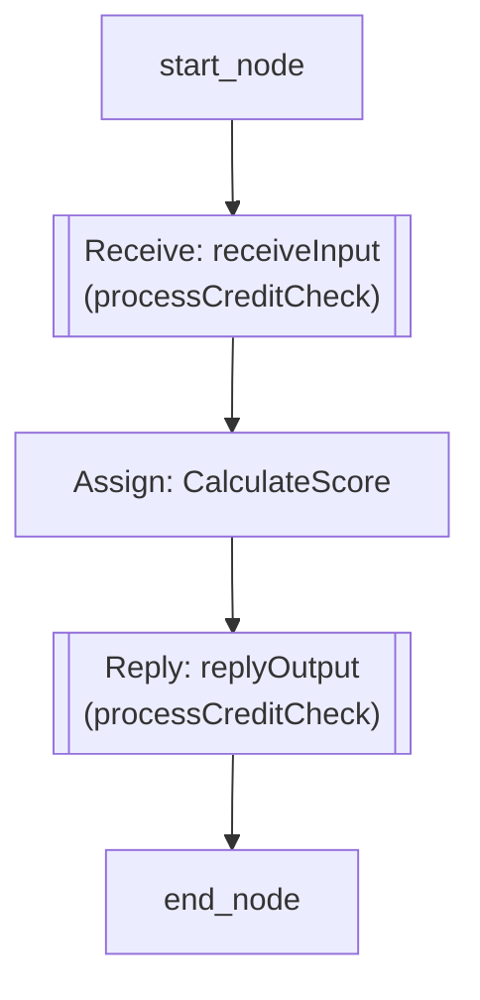

# BPEL Workflow Document: CreditProcess.bpel

This document contains the visual workflow representation of the BPEL process from `CreditProcess.bpel`.

## Flow Diagram

*Generated automatically using bpel_to_mermaid.py.*
