# BPEL Workflow Document: LoanApprovalProcess.bpel

This document contains the visual workflow representation of the BPEL process from `LoanApprovalProcess.bpel`.

## Flow Diagram

```mermaid
graph TD
    node1[["Receive: ReceiveRequest<br/>(initiateLoan)"]]
    node2{"If: CheckSanctionList<br/>(contains(lower-case($inputVar.payload/ns1:applicantName), 'voldemort') or ($inputVar.payload/ns1:ssn = '000-00-6666'))"}
    node3[Join CheckSanctionList]
    node4["Assign: AssignSanctionFault"]
    node5[["Reply: ReplySanctionFault<br/>(initiateLoan)"]]
    node6["Exit Process: ExitSanctionBlocked"]:::exitStyle
    classDef exitStyle fill:#f96,stroke:#333,stroke-width:2px;
    node4 --> node5
    node5 --> node6
    node2 -- "True" --> node4
    node6 --> node3
    node2 -- "False" --> node3
    node7["Scope: CreditScope"]
    node8["Assign: AssignCredit"]
    node9["Invoke: InvokeCredit<br/>(CreditProcessRef - processCreditCheck)"]
    node8 --> node9
    node7 --> node8
    node10["Scope: ValuationScope"]
    node11["Assign: AssignValuation"]
    node12["Invoke: InvokeValuation<br/>(ValuationProcessRef - appraise)"]
    node11 --> node12
    node10 --> node11
    node13{"If: WatchlistCheck<br/>(ends-with(translate($inputVar.payload/ns1:ssn, '-', ''), '9999'))"}
    node14[Join WatchlistCheck]
    node15["Throw: ns1:FraudAlertFault"]:::throwStyle
    classDef throwStyle fill:#f99,stroke:#333,stroke-width:2px;
    node13 -- "True" --> node15
    node15 --> node14
    node13 -- "False" --> node14
    node16["Assign: AssignUnderwriting"]
    node17["Invoke: InvokeUnderwriting<br/>(UnderwritingProcessRef - processUnderwriting)"]
    node18{"If: RouteDecision<br/>($underwritingResponse.payload/ns1:decision = 'AUTO_APPROVED')"}
    node19[Join RouteDecision]
    node20["Assign: AssignDisbursement"]
    node21["Invoke: InvokeDisbursement<br/>(DisbursementProcessRef - processDisbursement)"]
    node22["Assign: AssignNotification"]
    node23["Invoke: InvokeNotification<br/>(NotificationProcessRef - processNotification)"]
    node24["Assign: AssignApprovedResponse"]
    node20 --> node21
    node21 --> node22
    node22 --> node23
    node23 --> node24
    node18 -- "True" --> node20
    node24 --> node19
    node25{"ElseIf: ($underwritingResponse.payload/ns1:decision = 'AUTO_REJECTED')"}
    node18 -- "False" --> node25
    node26["Assign: AssignNotificationReject"]
    node27["Invoke: InvokeNotificationReject<br/>(NotificationProcessRef - processNotification)"]
    node28["Assign: AssignRejectedResponse"]
    node26 --> node27
    node27 --> node28
    node25 -- "True" --> node26
    node28 --> node19
    node29["Assign: AssignManualResponse"]
    node25 -- "False / Else" --> node29
    node29 --> node19
    node30[["Reply: ReplyClient<br/>(initiateLoan)"]]
    node1 --> node2
    node3 --> node7
    node9 --> node10
    node12 --> node13
    node14 --> node16
    node16 --> node17
    node17 --> node25
    node19 --> node30
    start_node --> node1
    node30 --> end_node
```

*Generated automatically using bpel_to_mermaid.py.*
