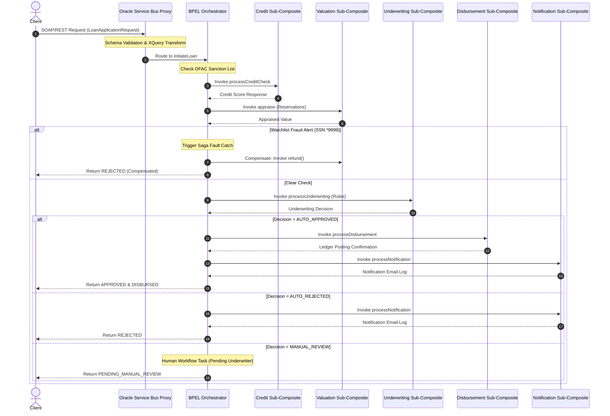

# Loan Orchestration System: Spring Boot & Oracle SOA Suite / OSB Architecture Reference

This project (Exercise 3) implements a distributed, transactional **Loan Processing Application** using a Spring Boot microservice reactor stack, paired with a matching **Oracle SOA Suite 12c Multi-Composite** and **Oracle Service Bus (OSB)** reference architecture.

---

## 1. System Topology & Architecture

The architecture consists of **6 active microservice modules** coordinated by a Master Orchestration layer (implemented in Java via REST and mapped to Oracle BPEL 2.0/OSB via SOAP):

```
                        +----------------------------+
                        |   Client / OSB Gateway     |
                        |  (LoanServiceProxy.proxy)  |
                        +--------------+-------------+
                                       | SOAP / REST
                                       v
                        +----------------------------+
                        |  Loan Orchestrator Service |
                        | (LoanApprovalProcess.bpel) |
                        +--------------+-------------+
                                       |
       +-----------------+-------------+-------------+-----------------+
       |                 |             |             |                 |
       v                 v             v             v                 v
+------------+    +-----------+  +------------+  +--------------+  +--------------+
|   Credit   |    | Valuation |  |Underwriter |  | Disbursement |  | Notification |
|  Service   |    |  Service  |  |  Service   |  |   Service    |  |   Service    |
| (Port 8082)|    |(Port 8083)|  |(Port 8084) |  | (Port 8085)  |  | (Port 8086)  |
+------------+    +-----------+  +------------+  +--------------+  +--------------+
```

---

## 2. End-to-End Application Flow

When a loan application is submitted, the system coordinates the following workflow:



---

## 3. Service-by-Service Business Logic

### A. `loan-service` (Port `8081`)
- **Role**: Core Web Orchestrator.
- **Business Flow**:
  1. Accepts client loan request submissions.
  2. Saves initial `SUBMITTED` state into H2 database.
  3. Dispatches orchestration steps inside an asynchronous thread pool.
  4. Hosts the premium monitoring dashboard where developers can trace Java runtime logs, compare side-by-side Oracle SOA XML equivalents, and claim manual underwriting tasks.

### B. `credit-service` (Port `8082`)
- **Role**: Equifax/Experian Credit Bureau simulator.
- **Business Flow**:
  - Receives the applicant's SSN.
  - Matches the SSN to simulate credit scores:
    - Ends with `4444`: Simulates latency by introducing a 6-second timeout.
    - Standard: Returns a positive score (e.g. `720`).

### C. `valuation-service` (Port `8083`)
- **Role**: Property Appraisal and Escrow Reservation.
- **Business Flow**:
  - **Appraisal**: Evaluates property estimate and makes a mock $500 fee reservation.
  - **Compensation Refund**: Exposes a refund endpoint invoked during transaction failures/rollbacks to clear reserved funds.

### D. `underwriting-service` (Port `8084`)
- **Role**: Business Rules Engine.
- **Business Flow**:
  - Evaluates financial ratios:
    - **Debt-to-Income (DTI)** = Monthly Loan Payment / Monthly Income.
    - **Loan-to-Value (LTV)** = Loan Amount / Appraised Property Value.
  - Returns:
    - `AUTO_APPROVED` if Credit Score >= 700 and LTV < 80%.
    - `AUTO_REJECTED` if Credit Score < 500.
    - `MANUAL_REVIEW` for borderline credit risks.

### E. `disbursement-service` (Port `8085`)
- **Role**: Core Banking Ledger Dispatch.
- **Business Flow**:
  - Accepts approved loan ID and amount.
  - Simulates settlement ledger postings and returns payment status.

### F. `notification-service` (Port `8086`)
- **Role**: User Messaging Service (UMS) Adapter.
- **Business Flow**:
  - Dispatches email alerts notifying applicants of final loan approvals or rejections.

---

## 4. How the BPEL Orchestration Flow Works

The **`loan-service-soa`** project coordinates the execution of the entire workflow. The orchestration is defined in **[`LoanApprovalProcess.bpel`](file:///c:/ramu/Project_Assignment/RapidX/FreddeMac_Project_RapidX/Work/OSB_SOA_Suite_Research_Notes/OSB_SOA_Suite_Ex3/loan-service-soa/LoanApprovalProcess.bpel)**:

### A. Partner Links (`<partnerLinks>`)
Wired in `composite.xml`, these are client service links connecting the orchestrator BPEL component directly to the standalone sub-composite WSDL targets on the server:
- `CreditProcessRef` -> `CreditCheckComposite`
- `ValuationProcessRef` -> `ValuationComposite`
- `UnderwritingProcessRef` -> `UnderwritingComposite`
- `DisbursementProcessRef` -> `DisbursementComposite`
- `NotificationProcessRef` -> `NotificationComposite`

### B. Sanction Lists & Exit Activities (`<if>` & `<exit>`)
At initialization, the BPEL engine runs a conditional check on the applicant's name and SSN. If it matches a watchlist database, the process populates an `OFAC-403` fault detail payload, replies to the client immediately, and triggers an `<exit>` activity to terminate the BPEL flow.

### C. OSB Retry Loops (`<scope>` & `<catch>`)
The BPEL process wraps the credit check in a transactional scope. If the credit check times out (e.g. SSN ending in `4444`), the parent OSB layer catches the transport failure, executes a **3-attempt backoff retry loop**, and if exhausted, throws `CreditServiceDownFault` to route the loan into a rejected sequence.

### D. Saga Transactions & Compensation (`<compensationHandler>` & `<compensate>`)
- The valuation call is wrapped in a dedicated `<scope name="ValuationScope">`.
- Inside this scope, we define a `<compensationHandler>` block. If triggered, it executes the rollback by invoking the `refund` operation on the Valuation sub-composite.
- If the subsequent security check fails (SSN ending in `9999`), a `FraudAlertFault` is thrown.
- The global `<catch faultName="ns1:FraudAlertFault">` catches the exception and executes a `<compensate target="ValuationScope"/>` activity, refunding the reserved appraisal fee before rejecting the application.

### E. Human Workflow Simulation
For cases where underwriting returns `MANUAL_REVIEW`, the BPEL engine halts automatic routing. The loan state is set to `PENDING_MANUAL_REVIEW`, suspending the BPEL instance until a human operator inputs review details via the dashboard and invokes an approval signal.

---

## 5. OSB Message Pipeline Virtualization

The Oracle Service Bus configurations in **`osb-services/`** act as an intelligent gateway:

- **WS-Policy Enforcement**: [`LoanServiceProxy.proxy`](file:///c:/ramu/Project_Assignment/RapidX/FreddeMac_Project_RapidX/Work/OSB_SOA_Suite_Research_Notes/OSB_SOA_Suite_Ex3/osb-services/LoanServiceProxy.proxy) enforces message security policies (e.g., `oracle/wss_username_token_service_policy`) at the boundary.
- **Pipeline Message Flow**: [`LoanServicePipeline.pipeline`](file:///c:/ramu/Project_Assignment/RapidX/FreddeMac_Project_RapidX/Work/OSB_SOA_Suite_Research_Notes/OSB_SOA_Suite_Ex3/osb-services/LoanServicePipeline.pipeline) intercepts requests.
  - **Schema Validation**: Validates the XML payload against [`LoanWorkflow.xsd`](file:///c:/ramu/Project_Assignment/RapidX/FreddeMac_Project_RapidX/Work/OSB_SOA_Suite_Research_Notes/OSB_SOA_Suite_Ex3/loan-service-soa/LoanWorkflow.xsd).
  - **XQuery Transformation**: Uses [`TransformRequest.xqy`](file:///c:/ramu/Project_Assignment/RapidX/FreddeMac_Project_RapidX/Work/OSB_SOA_Suite_Research_Notes/OSB_SOA_Suite_Ex3/osb-services/TransformRequest.xqy) to parse, sanitize, and format the data.
  - **Routing Nodes**: Dynamically forwards requests to the physical WSDL port of `loan-service-soa/loanapproval_client_ep`.

---

## 6. Java Class to BPEL Mapping & Linking

In enterprise systems, Java microservice classes and Oracle BPEL processes are mapped and linked using standard XML schemas, contract generation, and adapter bindings:

### A. Data Contract Mapping (Java POJO to XML Schema)
- **Java representation**: Java classes like `LoanApplicationRequest` (with properties like `applicantName`, `ssn`, and `loanAmount`) are standard Plain Old Java Objects (POJOs) containing getters/setters.
- **XML Schema representation**: These are mapped to XML Schema elements (`<xs:element name="LoanApplicationRequest">`) inside [`LoanWorkflow.xsd`](file:///c:/ramu/Project_Assignment/RapidX/FreddeMac_Project_RapidX/Work/OSB_SOA_Suite_Research_Notes/OSB_SOA_Suite_Ex3/loan-service-soa/LoanWorkflow.xsd).
- **Linking tool**: In Oracle WebLogic Server, JAXB (Java Architecture for XML Binding) annotations (like `@XmlRootElement`, `@XmlElement`) are used to automatically serialize Java POJO instances into the XML payloads processed by the BPEL partner links.

### B. Interface Conversion (Java Controllers to WSDL Ports)
- **Java representation**: Controller methods inside Spring Boot (like `OrchestrationService.initiateOrchestration(LoanApplicationRequest request)`) expose operations as REST API endpoints.
- **WSDL representation**: In Oracle BPEL, these are declared as SOAP operations inside portTypes (e.g. `<wsdl:operation name="initiateLoan">` inside [`LoanApprovalProcess.wsdl`](file:///c:/ramu/Project_Assignment/RapidX/FreddeMac_Project_RapidX/Work/OSB_SOA_Suite_Research_Notes/OSB_SOA_Suite_Ex3/loan-service-soa/LoanApprovalProcess.wsdl)).
- **Linking tool**: WebLogic Server uses JAX-WS annotations (like `@WebService`, `@WebMethod`) to compile Java class interfaces and expose them as virtual WSDL endpoints. The JDeveloper composite designer then consumes these WSDLs to create Partner Link bindings.

### C. Enterprise Java Beans (EJB) and Spring Adapters
- **SCA Spring Component Adapter**: Oracle SOA Suite provides a Spring JNDI adapter. If you have custom Java classes executing local business calculations (like credit score evaluations or debt ratio calculations), you can package them as Spring Beans.
- **Wiring**: The JDeveloper SCA designer compiles the Spring XML beans, generates a virtual wrapper, and makes the Java methods available inside the BPEL orchestration panel as draggable invoke activities.

### D. REST-to-SOAP Payload Transformation
- In our reactor architecture, the microservices communicate via REST (JSON).
- In Oracle Service Bus (OSB) and SOA Suite, the **REST Adapter** automatically translates incoming REST/JSON payloads to the XML payloads required by the BPEL engine. It maps:
  ```json
  { "applicantName": "John" }  <===>  <types:applicantName>John</types:applicantName>
  ```
  This links the Spring Boot Java runtime to the BPEL engine at the transport boundary.

---

## 7. Understanding BPEL Flows: WSDLs, Java & Generated Build Artifacts

### A. Do I need to convert WSDL to Java to understand the flow?
**No, you do not need to convert WSDL files to Java to understand a BPEL flow.**

- **Why?** WSDL (Web Services Description Language) files are strictly **interface contracts**. They describe what methods are available, what inputs they accept, and what outputs they return (similar to an OpenAPI/Swagger JSON or a Java interface declaration). They contain **no business logic or orchestration sequence**.
- The actual orchestration logic (invocations, conditional loops, fault handling) is defined inside the **`.bpel` XML file** (e.g. [`LoanApprovalProcess.bpel`](file:///c:/ramu/Project_Assignment/RapidX/FreddeMac_Project_RapidX/Work/OSB_SOA_Suite_Research_Notes/OSB_SOA_Suite_Ex3/loan-service-soa/LoanApprovalProcess.bpel)) or rendered visually via JDeveloper's designer or the Enterprise Manager Flow UI.
- **When is WSDL-to-Java conversion used?** You only convert WSDL to Java (generating client stubs using tools like `wsimport` or `cxf-codegen`) when you need to **write a programmatic Java client** (like a separate Spring Boot service or Java test) that invokes the SOAP-based BPEL composite.

### B. What is the use of generated files when building a SOA Suite project?
When building an Oracle SOA Suite composite (via JDeveloper, Maven, or Ant), the compiler (`scac` - SOA Composite Archive Compiler) validates and generates several files:

1. **`sca_*.sar` (SOA Archive) File**:
   - This is the deployment package. JDeveloper zips the composite XMLs, WSDLs, XSDs, and XQuery templates into this archive, which WebLogic consumes to instantiate the service.
2. **`SCA-INF/classes/` & `SCA-INF/src/`**:
   - If your composite includes custom Java components (like Spring context beans, custom XPath Java classes, or java-callout activities), the compiler generates and compiles these java classes into this folder so they can be packaged inside the `.sar`.
3. **MDS References & XML rewrites**:
   - The compiler verifies that all XML schema paths are valid. It rewrites relative imports (like `../soa-credit-composite/CreditProcess.wsdl`) to point to active local MDS directory paths, ensuring the composite can locate contracts on the runtime server.
4. **Static Type Validation Reports**:
   - The compiler acts as a static compiler for XML variables. If you attempt to assign an integer field to an XML element declared as a string in the XSD inside your BPEL `<assign>` mappings, the build generates validation warnings and errors, catching schema conflicts before server deployment.
