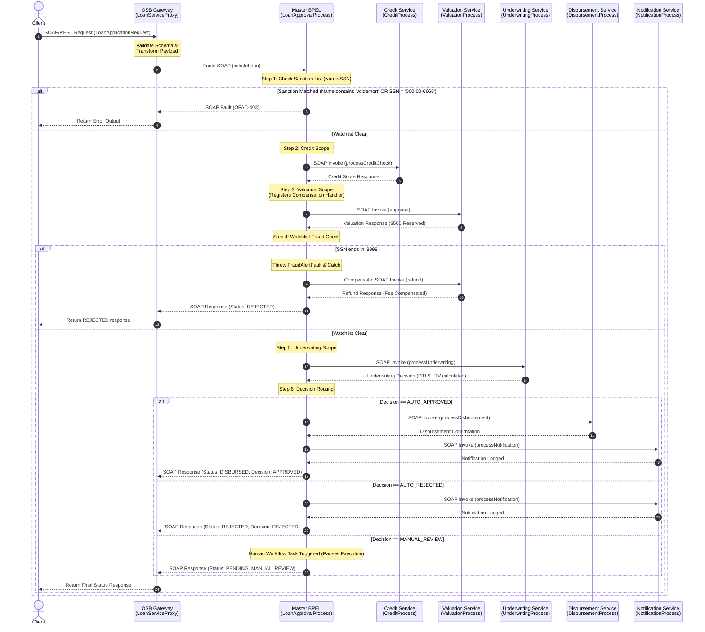

# Oracle SOA Suite & OSB BPEL Routing and Orchestration Flow Analysis

This document details the routing mechanisms and step-by-step execution path between the multiple BPEL processes and the Oracle Service Bus (OSB) gateway in the Loan Orchestration System.

---

## 1. Architectural Model: Orchestration (Hub-and-Spoke)

The system is designed using the **Orchestration Pattern** (rather than Choreography). The process flow is centralized, controlled, and coordinated by a single master component:

*   **The Hub (Master Orchestrator):** [`LoanApprovalProcess.bpel`](file:///c:/ramu/Project_Assignment/RapidX/FreddeMac_Project_RapidX/Work/OSB_SOA_Suite_Research_Notes/OSB_SOA_Suite_Ex3/loan-service-soa/LoanApprovalProcess.bpel) orchestrates the entire lifecycle of a loan application. It contains all business routing decisions, transaction scopes, saga compensations, and conditional branching.
*   **The Spokes (Sub-Composites):** The downstream BPEL services ([CreditProcess.bpel](file:///c:/ramu/Project_Assignment/RapidX/FreddeMac_Project_RapidX/Work/OSB_SOA_Suite_Research_Notes/OSB_SOA_Suite_Ex3/soa-credit-composite/CreditProcess.bpel), [ValuationProcess.bpel](file:///c:/ramu/Project_Assignment/RapidX/FreddeMac_Project_RapidX/Work/OSB_SOA_Suite_Research_Notes/OSB_SOA_Suite_Ex3/soa-valuation-composite/ValuationProcess.bpel), [UnderwritingProcess.bpel](file:///c:/ramu/Project_Assignment/RapidX/FreddeMac_Project_RapidX/Work/OSB_SOA_Suite_Research_Notes/OSB_SOA_Suite_Ex3/soa-underwriting-composite/UnderwritingProcess.bpel), [DisbursementProcess.bpel](file:///c:/ramu/Project_Assignment/RapidX/FreddeMac_Project_RapidX/Work/OSB_SOA_Suite_Research_Notes/OSB_SOA_Suite_Ex3/soa-disbursement-composite/DisbursementProcess.bpel), and [NotificationProcess.bpel](file:///c:/ramu/Project_Assignment/RapidX/FreddeMac_Project_RapidX/Work/OSB_SOA_Suite_Research_Notes/OSB_SOA_Suite_Ex3/soa-notification-composite/NotificationProcess.bpel)) act as focused, independent services. They only declare a single incoming partner link (to receive tasks from the hub and reply) and do not invoke other services directly.

---

## 2. Sequence Diagram of BPEL Routing Flow



---

## 3. Step-by-Step Routing & Message Transformations

### Step 1: Client Request Virtualization & OSB Processing
*   **Source:** External client client/reactor thread pool.
*   **Target:** [`LoanServiceProxy.proxy`](file:///c:/ramu/Project_Assignment/RapidX/FreddeMac_Project_RapidX/Work/OSB_SOA_Suite_Research_Notes/OSB_SOA_Suite_Ex3/osb-services/LoanServiceProxy.proxy).
*   **Routing Action:** The OSB proxy acts as a virtual gateway. The incoming request is processed by the pipeline [`LoanServicePipeline.pipeline`](file:///c:/ramu/Project_Assignment/RapidX/FreddeMac_Project_RapidX/Work/OSB_SOA_Suite_Research_Notes/OSB_SOA_Suite_Ex3/osb-services/LoanServicePipeline.pipeline):
    1.  **Validation Stage:** Verifies that the XML message matches the structure defined in `LoanWorkflow.xsd`.
    2.  **Transformation Stage:** Executes [`TransformRequest.xqy`](file:///c:/ramu/Project_Assignment/RapidX/FreddeMac_Project_RapidX/Work/OSB_SOA_Suite_Research_Notes/OSB_SOA_Suite_Ex3/osb-services/TransformRequest.xqy) to convert/cleanse the parameters.
    3.  **Routing Stage:** Dynamically routes the XML message to the physical service entry point `loanapproval_client_ep` exposed by the SOA composite.

```xml
<!-- OSB Pipeline Routing Config -->
<con2:route>
    <con3:id>_ActionId5</con3:id>
    <con2:service ref="loan-service-soa/loanapproval_client_ep" xsi:type="con:ServiceRef"/>
    <con2:operation>initiateLoan</con2:operation>
</con2:route>
```

---

### Step 2: Master BPEL Process Initiation & Security Guard Routing
*   **Source:** OSB Route Node.
*   **Target:** [`LoanApprovalProcess.bpel`](file:///c:/ramu/Project_Assignment/RapidX/FreddeMac_Project_RapidX/Work/OSB_SOA_Suite_Research_Notes/OSB_SOA_Suite_Ex3/loan-service-soa/LoanApprovalProcess.bpel).
*   **Routing Action:**
    1.  The BPEL engine receives the message on port `loanapproval_client_ep` via partner link `loanapproval_client`.
    2.  The `<receive>` activity triggers and instantiates a new BPEL runtime instance (`createInstance="yes"`).
    3.  **Watchlist Interception:** An `<if>` activity checks if the applicant matches a sanction list (SSN is `000-00-6666` or name contains `voldemort`).
    4.  If matched, the flow bypasses all downstream services, maps an `OFAC-403` error payload to a fault variable, sends a SOAP Fault response back via the `<reply>` activity, and immediately halts executing using `<exit>`.

```xml
<!-- Watchlist Route -->
<if name="CheckSanctionList">
  <condition>contains(lower-case($inputVar.payload/ns1:applicantName), 'voldemort') or ($inputVar.payload/ns1:ssn = '000-00-6666')</condition>
  <sequence name="SanctionFaultSequence">
    <assign name="AssignSanctionFault">...</assign>
    <reply name="ReplySanctionFault" partnerLink="loanapproval_client" portType="client:LoanApprovalProcess" operation="initiateLoan" variable="sanctionFaultVar" faultName="client:sanctionFault"/>
    <exit name="ExitSanctionBlocked"/>
  </sequence>
</if>
```

---

### Step 3: Credit Evaluation Routing
*   **Source:** [`LoanApprovalProcess.bpel`](file:///c:/ramu/Project_Assignment/RapidX/FreddeMac_Project_RapidX/Work/OSB_SOA_Suite_Research_Notes/OSB_SOA_Suite_Ex3/loan-service-soa/LoanApprovalProcess.bpel) (`CreditScope`).
*   **Target:** [`CreditProcess.bpel`](file:///c:/ramu/Project_Assignment/RapidX/FreddeMac_Project_RapidX/Work/OSB_SOA_Suite_Research_Notes/OSB_SOA_Suite_Ex3/soa-credit-composite/CreditProcess.bpel).
*   **Routing Action:**
    1.  The orchestrator copies the SSN from the client request variable to the `creditRequest` variable.
    2.  It executes `<invoke name="InvokeCredit">` targeting the `CreditProcessRef` partner link.
    3.  The sub-composite computes the score (defaulting to `720` or causing a 6-second timeout if the SSN ends in `4444` to test retry loops) and replies synchronously to the master orchestrator.

```xml
<invoke name="InvokeCredit" partnerLink="CreditProcessRef" portType="credit:CreditProcess" operation="processCreditCheck" inputVariable="creditRequest" outputVariable="creditResponse"/>
```

---

### Step 4: Property Appraisal Routing & Saga Compensation Registration
*   **Source:** [`LoanApprovalProcess.bpel`](file:///c:/ramu/Project_Assignment/RapidX/FreddeMac_Project_RapidX/Work/OSB_SOA_Suite_Research_Notes/OSB_SOA_Suite_Ex3/loan-service-soa/LoanApprovalProcess.bpel) (`ValuationScope`).
*   **Target:** [`ValuationProcess.bpel`](file:///c:/ramu/Project_Assignment/RapidX/FreddeMac_Project_RapidX/Work/OSB_SOA_Suite_Research_Notes/OSB_SOA_Suite_Ex3/soa-valuation-composite/ValuationProcess.bpel).
*   **Routing Action:**
    1.  The orchestrator maps property details to `valuationRequest` and invokes `ValuationProcessRef` via `<invoke name="InvokeValuation">`.
    2.  The valuation composite appraises the home and reserves a $500 fee.
    3.  **Compensation Registration:** Inside the scope, a `<compensationHandler>` is registered. If a downstream exception occurs later, this handler will be invoked to rollback the reserved appraisal fee by calling the `refund` operation on the Valuation service.

```xml
<scope name="ValuationScope">
  <compensationHandler>
    <sequence name="RefundSeq">
      <assign name="AssignRefund">...</assign>
      <invoke name="InvokeValuationRefund" partnerLink="ValuationProcessRef" portType="val:ValuationProcess" operation="refund" inputVariable="refundRequest" outputVariable="refundResponse"/>
    </sequence>
  </compensationHandler>
  <sequence name="ValuationSeq">
    <invoke name="InvokeValuation" partnerLink="ValuationProcessRef" portType="val:ValuationProcess" operation="appraise" inputVariable="valuationRequest" outputVariable="valuationResponse"/>
  </sequence>
</scope>
```

---

### Step 5: Fraud-Triggered Saga Rollback Routing
*   **Source:** [`LoanApprovalProcess.bpel`](file:///c:/ramu/Project_Assignment/RapidX/FreddeMac_Project_RapidX/Work/OSB_SOA_Suite_Research_Notes/OSB_SOA_Suite_Ex3/loan-service-soa/LoanApprovalProcess.bpel) (Global Fault Handlers).
*   **Target:** [`ValuationProcess.bpel`](file:///c:/ramu/Project_Assignment/RapidX/FreddeMac_Project_RapidX/Work/OSB_SOA_Suite_Research_Notes/OSB_SOA_Suite_Ex3/soa-valuation-composite/ValuationProcess.bpel) (Refund endpoint).
*   **Routing Action:**
    1.  If the applicant's SSN ends in `9999`, the orchestrator throws a `FraudAlertFault`.
    2.  The global fault handler catches the exception and executes `<compensate target="ValuationScope"/>`.
    3.  This triggers the registered compensation sequence, routing a call to the Valuation service's `refund` operation to restore the $500.
    4.  The orchestrator then replies to the client with `REJECTED` and exits.

```xml
<catch faultName="ns1:FraudAlertFault">
  <sequence name="FraudCompensationSequence">
    <compensate target="ValuationScope"/> <!-- Triggers rollback call -->
    <assign name="AssignFraudRejection">...</assign>
    <reply name="ReplyFraudRejection" partnerLink="loanapproval_client" portType="client:LoanApprovalProcess" operation="initiateLoan" variable="outputVar"/>
  </sequence>
</catch>
```

---

### Step 6: Underwriting Rules Evaluation Routing
*   **Source:** [`LoanApprovalProcess.bpel`](file:///c:/ramu/Project_Assignment/RapidX/FreddeMac_Project_RapidX/Work/OSB_SOA_Suite_Research_Notes/OSB_SOA_Suite_Ex3/loan-service-soa/LoanApprovalProcess.bpel).
*   **Target:** [`UnderwritingProcess.bpel`](file:///c:/ramu/Project_Assignment/RapidX/FreddeMac_Project_RapidX/Work/OSB_SOA_Suite_Research_Notes/OSB_SOA_Suite_Ex3/soa-underwriting-composite/UnderwritingProcess.bpel).
*   **Routing Action:**
    1.  The orchestrator aggregates variables (`creditScore`, `loanAmount`, `monthlyIncome`, `propertyValue`) and maps them to `underwritingRequest`.
    2.  It invokes the `UnderwritingProcessRef` partner link.
    3.  The underwriting rules engine determines if the ratios warrant `AUTO_APPROVED`, `AUTO_REJECTED`, or `MANUAL_REVIEW` and returns the decision.

```xml
<invoke name="InvokeUnderwriting" partnerLink="UnderwritingProcessRef" portType="under:UnderwritingProcess" operation="processUnderwriting" inputVariable="underwritingRequest" outputVariable="underwritingResponse"/>
```

---

### Step 7: Post-Decision Final Routing Branches
Following the underwriting response, the orchestrator evaluates a conditional `<if>` routing block to decide the final execution paths:

#### Branch A: `AUTO_APPROVED` (Disbursement & Notification)
1.  **Disbursement:** Assigns details to `disbursementRequest` and invokes `DisbursementProcessRef` (calling [`DisbursementProcess.bpel`](file:///c:/ramu/Project_Assignment/RapidX/FreddeMac_Project_RapidX/Work/OSB_SOA_Suite_Research_Notes/OSB_SOA_Suite_Ex3/soa-disbursement-composite/DisbursementProcess.bpel)) to book the ledger transaction.
2.  **Notification:** Assigns details to `notificationRequest` and invokes `NotificationProcessRef` (calling [`NotificationProcess.bpel`](file:///c:/ramu/Project_Assignment/RapidX/FreddeMac_Project_RapidX/Work/OSB_SOA_Suite_Research_Notes/OSB_SOA_Suite_Ex3/soa-notification-composite/NotificationProcess.bpel)) to dispatch an approval email log.
3.  **Reply:** Sends a SOAP reply back to the client via `loanapproval_client` with status `DISBURSED` / decision `APPROVED`.

#### Branch B: `AUTO_REJECTED` (Notification Only)
1.  **Notification:** Invokes `NotificationProcessRef` to send a rejection email notification.
2.  **Reply:** Sends a SOAP reply back to the client via `loanapproval_client` with status `REJECTED` / decision `REJECTED`.

#### Branch C: `MANUAL_REVIEW` (Human Workflow Suspension)
1.  **Yield Control:** Instead of routing to disbursement or notification, the BPEL orchestrator assigns a status of `PENDING_MANUAL_REVIEW` / decision `PENDING`.
2.  **Pause:** It returns the payload to the client, parking the BPEL instance in the database in a suspended state.
3.  **Resume:** The process waits for manual review intervention by an underwriter via the Spring dashboard, which triggers the final approval/rejection signals to resume the workflow.

---

## 4. Service Bindings & SCA composite.xml Configuration

The physical mapping of these BPEL processes on the server is configured via Service Component Architecture (SCA) wires inside **[`loan-service-soa/composite.xml`](file:///c:/ramu/Project_Assignment/RapidX/FreddeMac_Project_RapidX/Work/OSB_SOA_Suite_Research_Notes/OSB_SOA_Suite_Ex3/loan-service-soa/composite.xml)**.

### Declaring WSDL Interfaces & Endpoints
The composite references bind the logical BPEL `<partnerLink>` names to physical SOAP/WSDL endpoints exposed by WebLogic server:

```xml
<!-- Reference definition inside composite.xml -->
<reference name="CreditProcessRef" ui:wsdlLocation="../soa-credit-composite/CreditProcess.wsdl">
  <interface.wsdl interface="http://xmlns.oracle.com/LoanOrchestration/CreditProcess#wsdl.interface(CreditProcess)"/>
  <binding.ws port="http://xmlns.oracle.com/LoanOrchestration/CreditProcess#wsdl.endpoint(creditprocess_client_ep/CreditProcess_pt)"
              location="http://localhost:8082/soap/CreditProcess?wsdl"
              soapVersion="1.1"/>
</reference>
```

### SCA Wiring
Wiring tags link the logical references of the BPEL implementation component (`LoanApprovalProcess/ReferenceName`) to the outbound reference bindings (`ReferenceName`):

```xml
<!-- Wiring bindings linking master to sub-composites -->
<wire>
  <source.uri>LoanApprovalProcess/CreditProcessRef</source.uri>
  <target.uri>CreditProcessRef</target.uri>
</wire>
<wire>
  <source.uri>LoanApprovalProcess/ValuationProcessRef</source.uri>
  <target.uri>ValuationProcessRef</target.uri>
</wire>
<wire>
  <source.uri>LoanApprovalProcess/UnderwritingProcessRef</source.uri>
  <target.uri>UnderwritingProcessRef</target.uri>
</wire>
<wire>
  <source.uri>LoanApprovalProcess/DisbursementProcessRef</source.uri>
  <target.uri>DisbursementProcessRef</target.uri>
</wire>
<wire>
  <source.uri>LoanApprovalProcess/NotificationProcessRef</source.uri>
  <target.uri>NotificationProcessRef</target.uri>
</wire>
```

### Deployed Sub-Composite Endpoint Mapping

The sub-composites are accessible via HTTP SOAP bindings at the following locations in the architecture:

| Sub-Composite BPEL File | composite.xml Reference Name | SOAP Service Endpoint URL |
| :--- | :--- | :--- |
| **[`CreditProcess.bpel`](file:///c:/ramu/Project_Assignment/RapidX/FreddeMac_Project_RapidX/Work/OSB_SOA_Suite_Research_Notes/OSB_SOA_Suite_Ex3/soa-credit-composite/CreditProcess.bpel)** | `CreditProcessRef` | `http://localhost:8082/soap/CreditProcess?wsdl` |
| **[`ValuationProcess.bpel`](file:///c:/ramu/Project_Assignment/RapidX/FreddeMac_Project_RapidX/Work/OSB_SOA_Suite_Research_Notes/OSB_SOA_Suite_Ex3/soa-valuation-composite/ValuationProcess.bpel)** | `ValuationProcessRef` | `http://localhost:8083/soap/ValuationProcess?wsdl` |
| **[`UnderwritingProcess.bpel`](file:///c:/ramu/Project_Assignment/RapidX/FreddeMac_Project_RapidX/Work/OSB_SOA_Suite_Research_Notes/OSB_SOA_Suite_Ex3/soa-underwriting-composite/UnderwritingProcess.bpel)** | `UnderwritingProcessRef` | `http://localhost:8084/soap/UnderwritingProcess?wsdl` |
| **[`DisbursementProcess.bpel`](file:///c:/ramu/Project_Assignment/RapidX/FreddeMac_Project_RapidX/Work/OSB_SOA_Suite_Research_Notes/OSB_SOA_Suite_Ex3/soa-disbursement-composite/DisbursementProcess.bpel)** | `DisbursementProcessRef` | `http://localhost:8085/soap/DisbursementProcess?wsdl` |
| **[`NotificationProcess.bpel`](file:///c:/ramu/Project_Assignment/RapidX/FreddeMac_Project_RapidX/Work/OSB_SOA_Suite_Research_Notes/OSB_SOA_Suite_Ex3/soa-notification-composite/NotificationProcess.bpel)** | `NotificationProcessRef` | `http://localhost:8086/soap/NotificationProcess?wsdl` |
